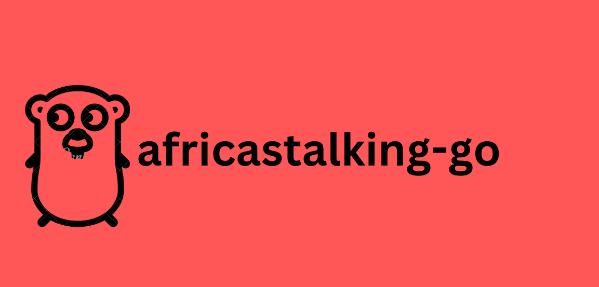

<p align="center">
<br><br>
<b>STILL IN BETA!</b><BR><BR>


</p>


#  African's Talking Go SDK


African's Talking Go SDK is a comprehensive Go library for interacting with the Africa's Talking API, a platform that provides various communication and payment services across Africa.

## Features


- **SMS**: Send and receive SMS messages to and from any network in Africa
- **Voice**: Make and receive voice calls, play media, and control the call flow
- **USSD**: Create interactive menus and sessions for your users
- **Airtime**: Send airtime to mobile subscribers across Africa
- **Payments**: Accept and disburse payments via mobile money, card, and bank


## Installation

To install the SDK, you need to have Go 1.17 or higher installed on your machine. You also need to have an account with Africa's Talking and get an API key and a username.

- Install the SDK using the go get command:

```bash
go get github.com/MikeMwita/africastalking-go
```

- Import the SDK in your code using the import statement:

```go
import "github.com/MikeMwita/africastalking-go"
```

## Usage

To use the SDK, you need to create a client object and pass it your username and API key. You can then use the client object to access the different services and their methods. For example, you can use something like this:

```go
package main

import (
	"fmt"
	"log"

	"github.com/YOUR_USERNAME/africastalking-go"
)

func main() {
	// Create a client object with your username and API key
	client := africastalking.NewClient("YOUR_USERNAME", "YOUR_API_KEY")

	// Use the client object to access the SMS service
	smsService := client.SMS

	// Create an SMS sender object with the required parameters
	smsSender := smsService.SmsSender{
		Recipients: []string{"+254712345678"},
		Message:    "Hello, this is a test message from Africa's Talking",
		Sender:     "YOUR_SENDER",
	}

	// Call the Send method and get the result
	res, err := smsService.Send(smsSender)
	if err != nil {
		log.Fatal(err)
	}
	fmt.Println(res)
}
```

## Testing

To test the SDK, you need to have a test database and a test account with Africa's Talking. You also need to set some environment variables for the test configuration.

- Create a test database and populate it with some test data
- Create a test account with Africa's Talking and get a test API key and a test username
- Set the following environment variables:

```bash
export AT_TEST_DB_CONNECTION_STRING=YOUR_TEST_DB_CONNECTION_STRING # The connection string for your test database
export AT_TEST_API_KEY=YOUR_TEST_API_KEY # The API key for your test account
export AT_TEST_USERNAME=YOUR_TEST_USERNAME # The username for your test account
```

- Run the tests using the go test command and pass it the -cover flag:

```bash
go test -cover ./...
```


